---
---

## Содержание

- [Создание новой базы данных](#создание-новой-базы-данных)
- [Создание таблицы](#создание-таблицы)
- [Заполнение таблицы](#заполнение-таблицы)
- [Чтение данных из таблицы](#чтение-данных-из-таблицы) 
    - [Фильтрация](#фильтрация)
---
---

## Создание новой базы данных

Жмём на созданного пользователя откроется список, необходимо нажать на параметр **Databases** правой кнопкой мыши и выбираем параметр **Create** -> **Database...**

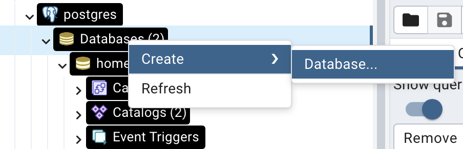

---

Далее откроется окно создания базы данных. Необходимо задать название для неё. Вводим *homework_1* и нажимаем **Save**.

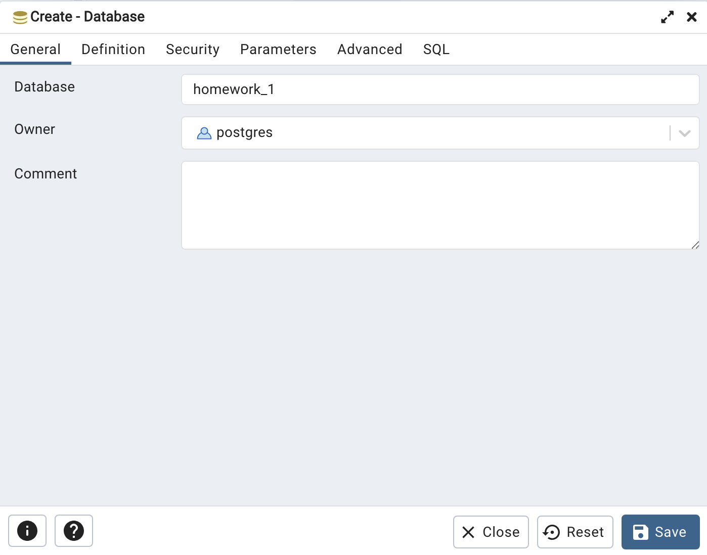

## Создание таблицы

Открываем **Query Tool** в **pgAdmin** с помощью правой кнопки мыши, кликнув по названию базы данных (*homework_1*).

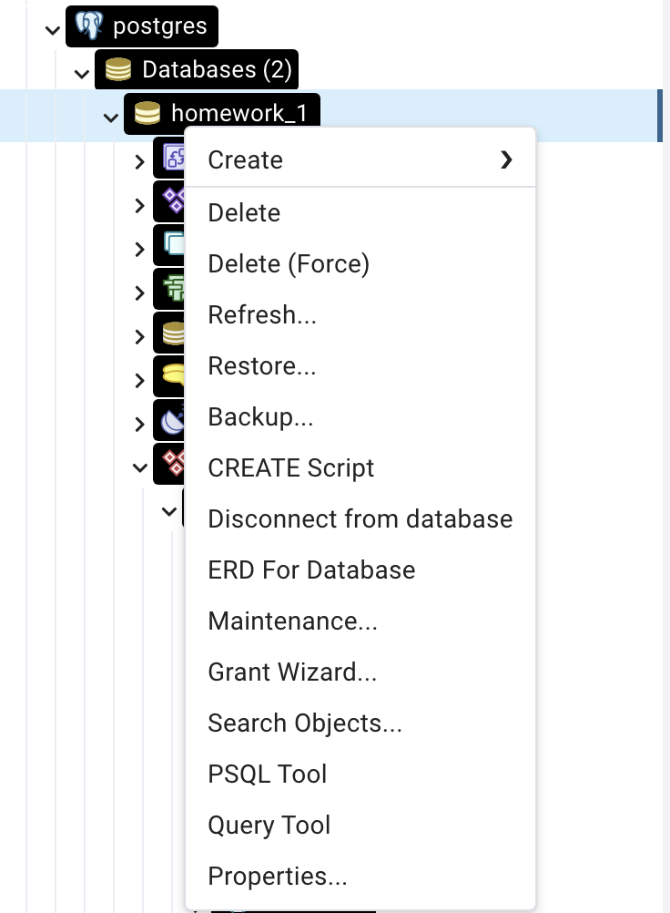

---

В новом окне вводим запрос и нажимаем выполнить (*F5*): 

```
CREATE TABLE CARS
(
    Id SERIAL PRIMARY KEY,
    Company VARCHAR(30),
    Model VARCHAR(30),
	Engine INTEGER,
    HorsePower INTEGER,
    Weight INTEGER,
	Color VARCHAR(30)
);
```

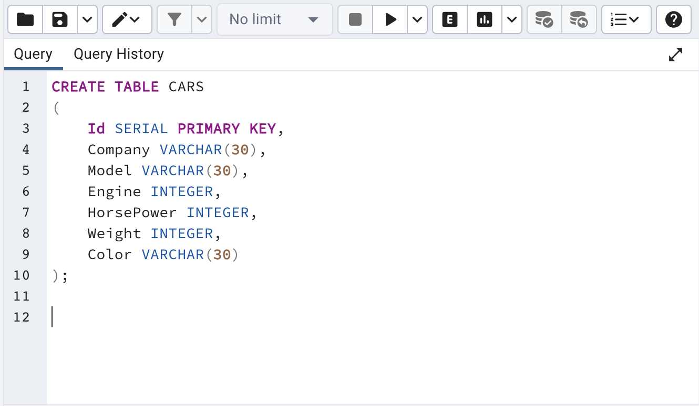

---

Проверим наличие таблицы. Нажимаем **Schemas** -> **Tables** и видим, что таблица была действительно создана. 

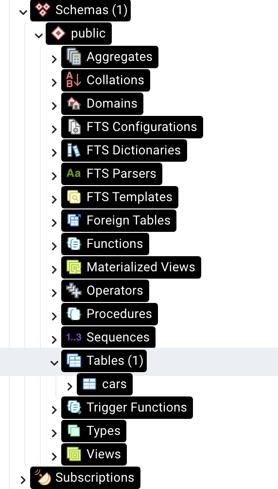

## Заполнение таблицы

Чтобы заполнить таблицу данными, необходимо снова открыть **Query Tool**  (см. [создание таблицы](#создание-таблицы)).

Далее вводим запрос и нажимаем выполнить (*F5*):

```
INSERT INTO CARS VALUES(1, 'BMW', 'M4', 6, 520, 2, 'GREEN')
```
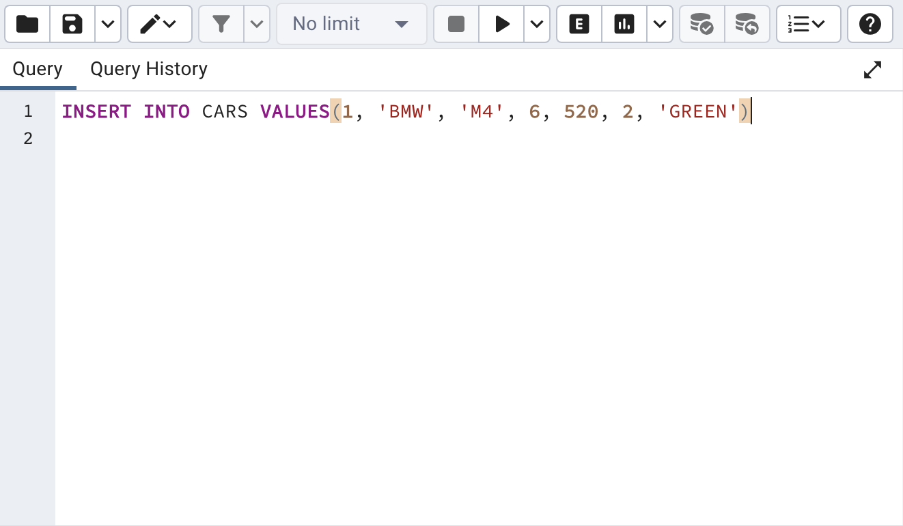

---

Аналогично добавляем побольше данных в нашу таблицу.

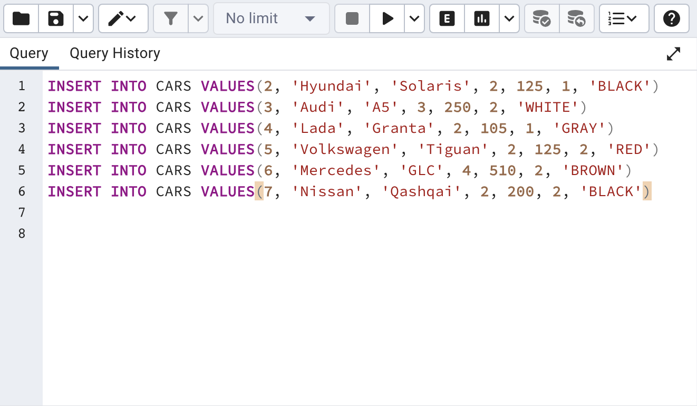

---

Теперь можем посмотреть на нашу таблицу. Нажмём на нашу таблицу *cars* правой кнопкой мыши и выберем **View/Edit Data** -> **All Rows**.

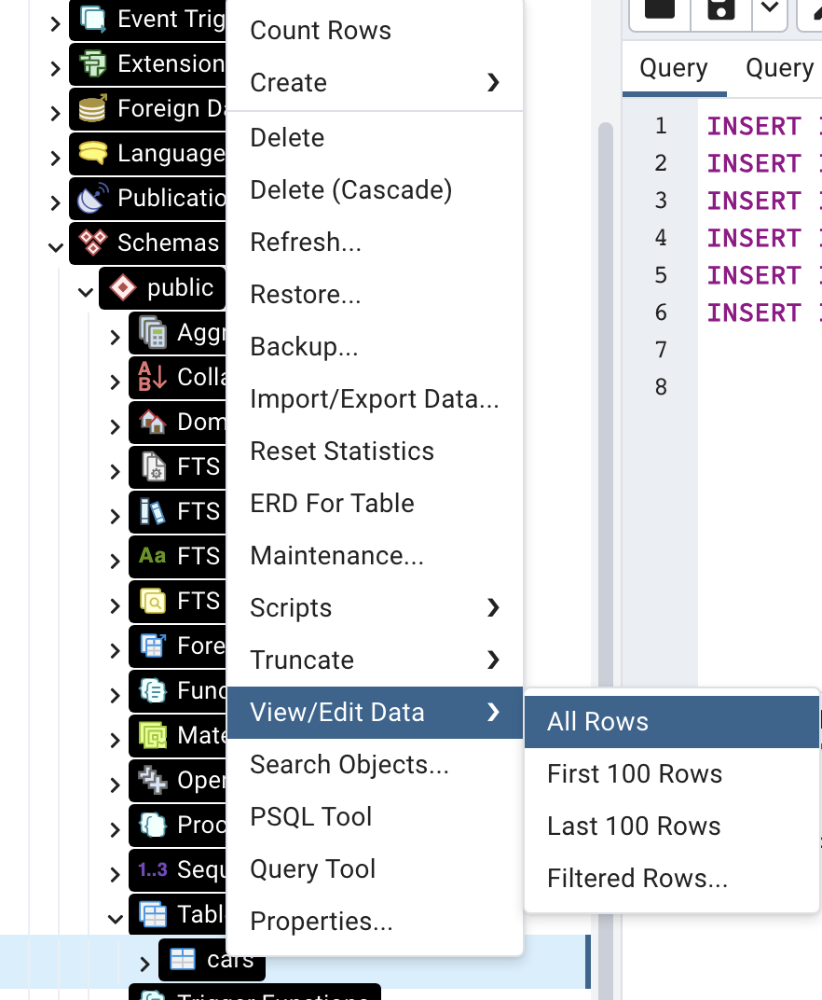

У нас откроется новое окно, в котором будет представлена таблица с введёнными данными о 7 объектах:

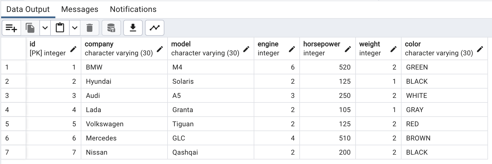

---

Либо все в том же **Query Tool** можно выполнить такой запрос: 

```
SELECT * FROM public.cars
ORDER BY id ASC 
```

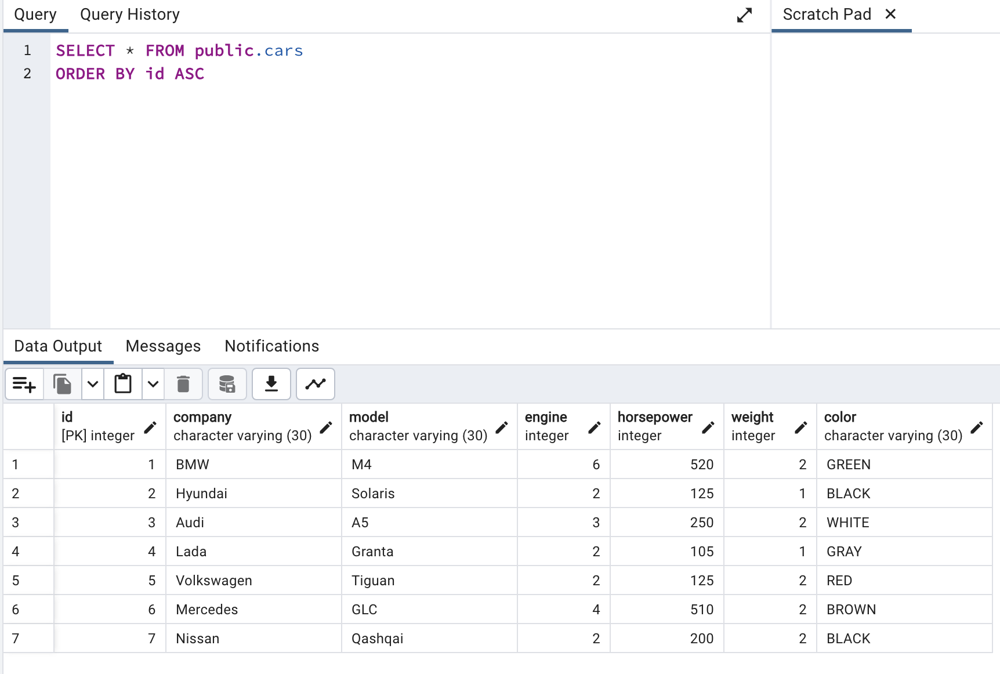

## Чтение данных из таблицы

Чтобы выполнить чтение данных из таблицы, необходимо использовать команду ``SELECT``:

Например, запросим данные из таблицы по столбцам *company, model, weight*:

```
SELECT company, model, weight FROM public.cars
ORDER BY id ASC 
```

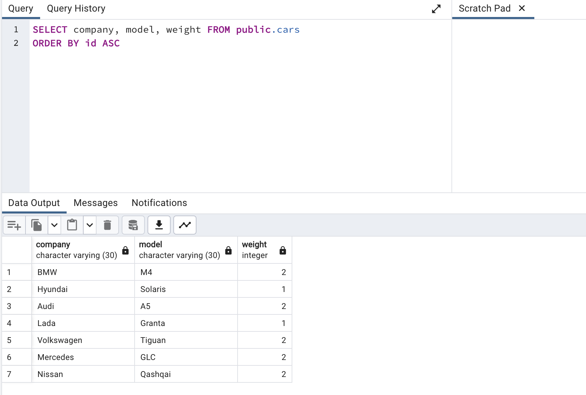

---

### Фильтрация

Для фильтрации используем параметр ``WHERE``

Выполним такой же запрос, только добавим фильтрацию по объёму двигателя:

```
SELECT company, model, weight FROM public.cars
WHERE engine > 3
ORDER BY id ASC 
```

---

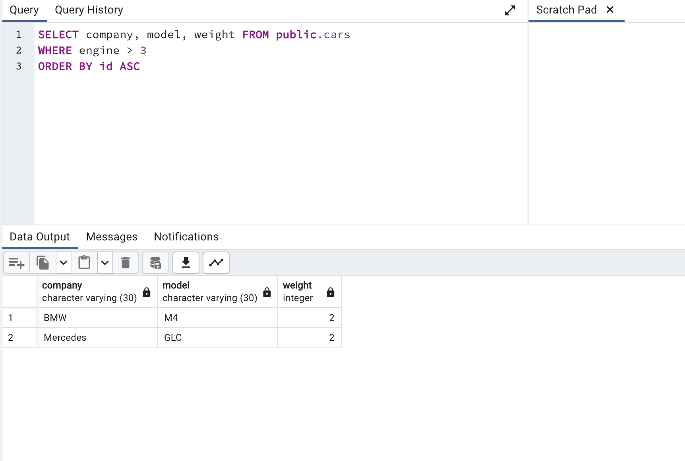

Немного изменим запрос, будем выводить всю информацию о машинах, но с фильтром *horsepower > 210*:

```
SELECT * FROM public.cars
WHERE horsepower > 210
ORDER BY id ASC 
```
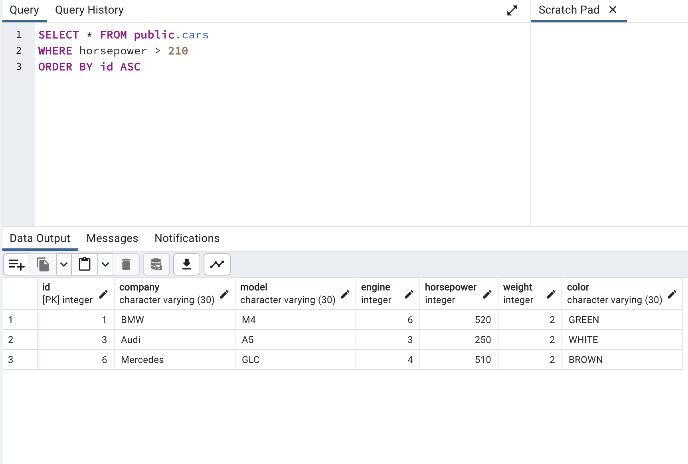

---