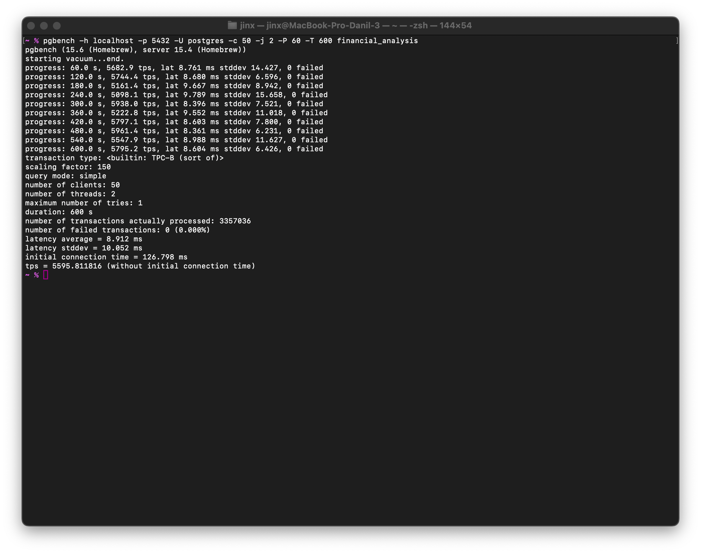
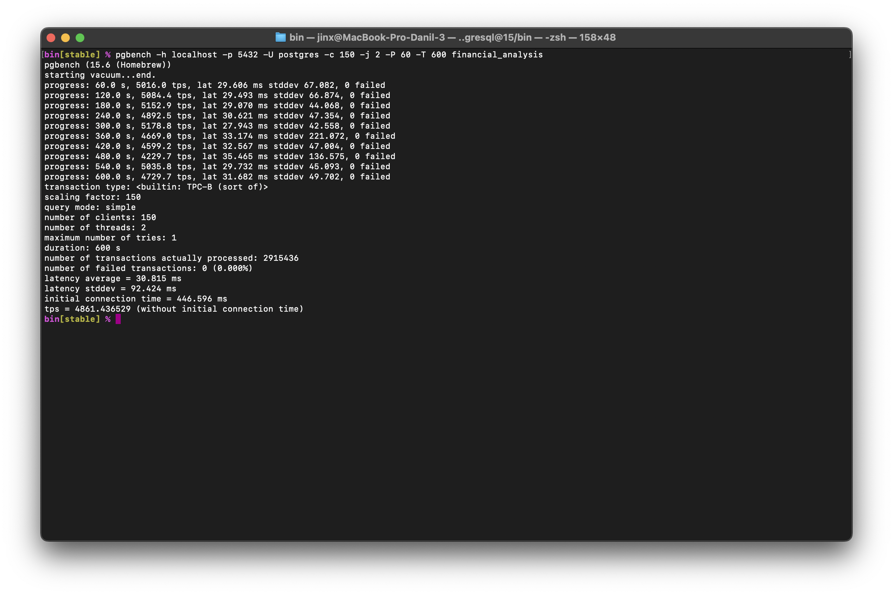
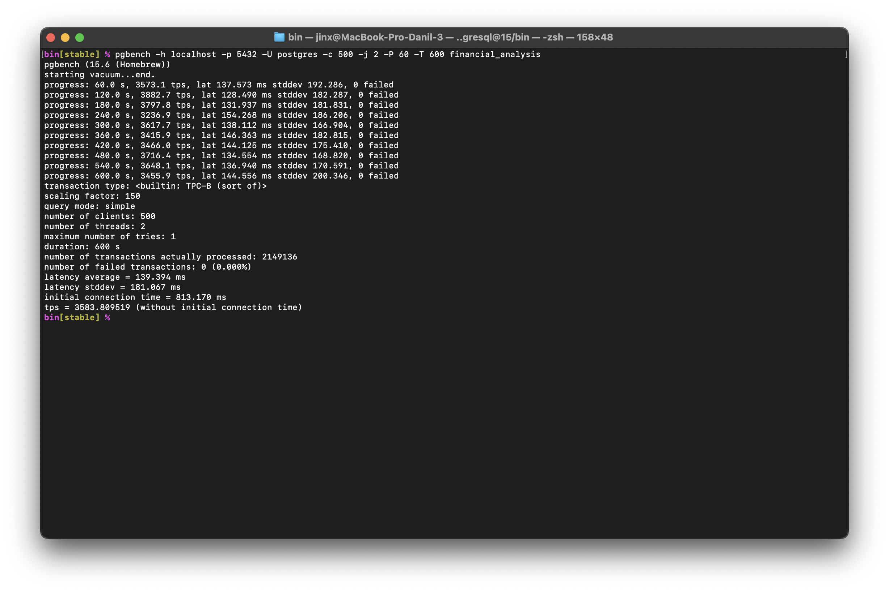

## Содержание

- [Проектирование базы данных по варианту](#проектирование-базы-данных-по-варианту)
- [Генерация данных](#генерация-данных)
- [Тест производительности базы данных с помощью PGBENCH](#тест-производительности-базы-данных-с-помощью-pgbench)
- [Вывод](#вывод)


## Проектирование базы данных по варианту

#### Создание базы данных

```sql
CREATE DATABASE financial_analysis;
```

#### Создание таблицы для хранения информации о показателях:

```sql
CREATE TABLE Indicators (
    IndicatorCode SERIAL PRIMARY KEY,
    Name VARCHAR(255) NOT NULL,
    Importance NUMERIC NOT NULL,
    UnitOfMeasurement VARCHAR(50) NOT NULL
);
```

#### Создание таблицы для хранения информации о предприятиях:

```sql
CREATE TABLE Enterprises (
    EnterpriseCode SERIAL PRIMARY KEY,
    Name VARCHAR(255) NOT NULL,
    BankDetails VARCHAR(255) NOT NULL,
    Phone VARCHAR(20) NOT NULL,
    ContactPerson VARCHAR(100) NOT NULL
);
```

#### Создание таблицы для хранения динамики показателей предприятий:

```sql
CREATE TABLE IndicatorDynamics (
    IndicatorCode INT REFERENCES Indicators(IndicatorCode),
    EnterpriseCode INT REFERENCES Enterprises(EnterpriseCode),
    Value NUMERIC NOT NULL,
    MeasurementDate DATE NOT NULL,
    PRIMARY KEY (IndicatorCode, EnterpriseCode, MeasurementDate)
);
```

## Генерация данных

Генерацию данных производил с помощью `Faker` для python.

``` python
from faker import Faker
import psycopg2
import random
from datetime import datetime, timedelta

fake = Faker()

# Подключение к базе данных
conn = psycopg2.connect(database="financial_analysis", user="postgres", password="postgres", host="localhost",
                        port="5432")
cur = conn.cursor()

# Генерация данных для таблицы Indicators
for i in range(1, 101):  # Создаем 5 показателей
    name = fake.word()
    importance = random.uniform(0.1, 0.9)  # Случайная важность показателя
    unit_of_measurement = fake.word()

    # Вставляем данные показателя в таблицу Indicators
    cur.execute("INSERT INTO Indicators (Name, Importance, UnitOfMeasurement) VALUES (%s, %s, %s)",
                (name, importance, unit_of_measurement))

# Получаем все уникальные значения IndicatorCode из таблицы Indicators
cur.execute("SELECT DISTINCT IndicatorCode FROM Indicators")
indicator_codes = [row[0] for row in cur.fetchall()]

# Генерация данных для таблицы Enterprises и IndicatorDynamics
for _ in range(101):  # Создаем 5 предприятий
    enterprise_name = fake.company()
    bank_details = fake.iban()
    phone = fake.phone_number()[:20]  # Ограничиваем длину номера телефона до 20 символов
    contact_person = fake.name()

    # Вставляем данные предприятия в таблицу Enterprises
    cur.execute(
        "INSERT INTO Enterprises (Name, BankDetails, Phone, ContactPerson) VALUES (%s, %s, %s, %s) RETURNING EnterpriseCode",
        (enterprise_name, bank_details, phone, contact_person))
    enterprise_code = cur.fetchone()[0]  # Получаем код предприятия, который был назначен автоматически

    # Генерация случайных данных для показателей предприятия на протяжении нескольких месяцев
    start_date = datetime(2023, 1, 1)
    end_date = datetime(2023, 12, 31)
    current_date = start_date
    while current_date <= end_date:
        for indicator_code in indicator_codes:  # Используем все уникальные значения IndicatorCode из таблицы Indicators
            value = random.uniform(1000, 100000)  # Случайное значение для показателя
            # Вставляем данные динамики показателя в таблицу IndicatorDynamics
            cur.execute(
                "INSERT INTO IndicatorDynamics (IndicatorCode, EnterpriseCode, Value, MeasurementDate) VALUES (%s, %s, %s, %s)",
                (indicator_code, enterprise_code, value, current_date))
        current_date += timedelta(days=30)  # Увеличиваем дату на 30 дней

# Коммитим изменения и закрываем соединение
conn.commit()
conn.close()
```

## Тест производительности базы данных с помощью PGBENCH

#### Тест на 50 подключений

```bash
pgbench -h localhost -p 5432 -U postgres -c 50 -j 2 -P 60 -T 600 financial_analysis
```



#### Тест на 150 подключений

```bash
pgbench -h localhost -p 5432 -U postgres -c 150 -j 2 -P 60 -T 600 financial_analysis
```



#### Тест на 500 подключений

```bash
pgbench -h localhost -p 5432 -U postgres -c 500 -j 2 -P 60 -T 600 financial_analysis
```



## Вывод

По результатам тестов видно как уменьшается пропускная способность с увеличением числа пользователей.

<table border="2">
  <tr>
    <th></th>
    <th>50 пользователей</th>
    <th>150 пользователей</th>
    <th>500 пользователей</th>
  </tr>
  <tr>
    <th>60.0 s</th>
    <td>5682.9 tps</td>
    <td>5016.0 tps</td>
    <td>3573.1 tps</td>
  </tr>
  <tr>
    <th>120.0 s</th>
    <td>5744.4 tps</td>
    <td>5084.4 tps</td>
    <td>3882.7 tps</td>
  </tr>
  <tr>
    <th>180.0 s</th>
    <td>5161.4 tps</td>
    <td>5152.9 tps</td>
    <td>3797.8 tps</td>
  </tr>
  <tr>
    <th>240.0 s</th>
    <td>5098.1 tps</td>
    <td>4892.5 tps</td>
    <td>3236.9 tps</td>
  </tr>
  <tr>
    <th>300.0 s</th>
    <td>5938.0 tps</td>
    <td>5178.8 tps</td>
    <td>3617.7 tps</td>
  </tr>
  <tr>
    <th>360.0 s</th>
    <td>5222.8 tps</td>
    <td>4669.0 tps</td>
    <td>3415.9 tps</td>
  </tr>
  <tr>
    <th>420.0 s</th>
    <td>5797.1 tps</td>
    <td>4599.2 tps</td>
    <td>3466.0 tps</td>
  </tr>
  <tr>
    <th>480.0 s</th>
    <td>5961.4 tps</td>
    <td>4229.7 tps</td>
    <td>3716.4 tps</td>
  </tr>
  <tr>
    <th>540.0 s</th>
    <td>5547.9 tps</td>
    <td>5035.8 tps</td>
    <td>3648.1 tps</td>
  </tr>
  <tr>
    <th>600.0 s</th>
    <td>5795.2 tps</td>
    <td>4729.7 tps</td>
    <td>3455.9 tps</td>
  </tr>
</table>