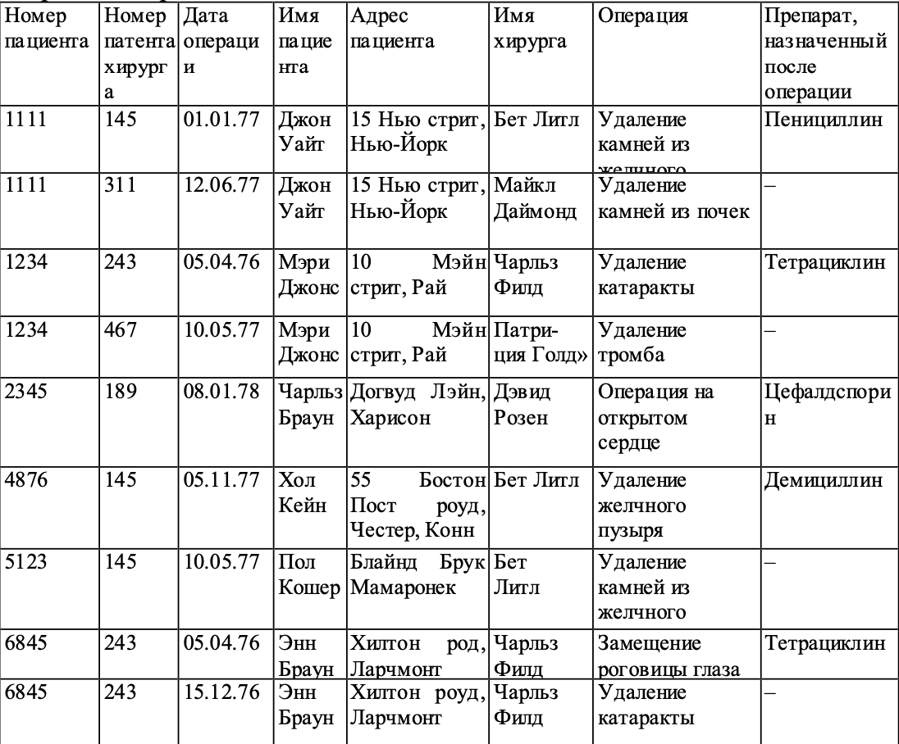
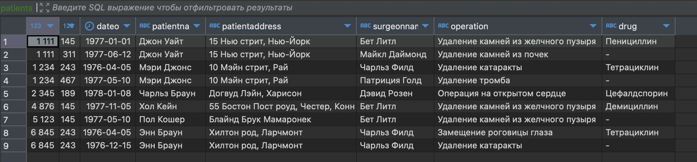
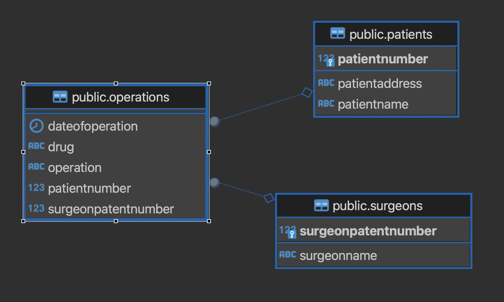
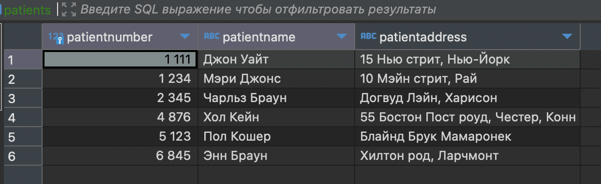
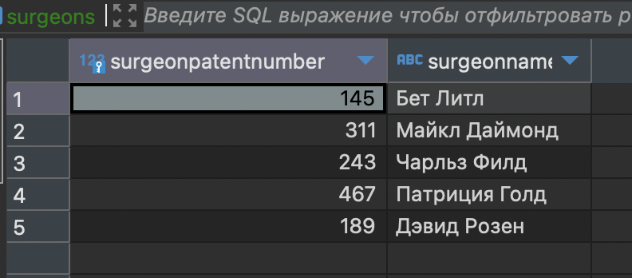

## Содержание

- [Создание базы данных и заполнение таблиц данными](#создание-базы-данных-и-заполнение-таблиц-данными)
    - [Создание базы данных](#создание-базы-данных)
    - [Создание таблицы с пациентами](#создание-таблицы-с-пациентами)
    - [Заполнение таблиц данными](#заполнение-таблиц-данными)

- [Первая нормальная форма](#первая-нормальная-форма)
    - [Таблица "Patients"](#таблица-patients)
    - [Таблица "Surgeons"](#таблица-surgeons)
    - [Таблица "Operations"](#таблица-operations)

- [Вторая нормальная форма](#вторая-нормальная-форма)

- [Третья нормальная форма](#третья-нормальная-форма)

- [Итог](#итог)
    - [Таблица "Patients"](#patients)
    - [Таблица "Surgeons"](#surgeons)
    - [Таблица "Operations"](#operations)
    - [Схема зависимостей между таблицами](#схема-зависимостей-между-таблицами)

---

## Создание базы данных и заполнение таблиц данными

#### Создание базы данных

Для 19 варианта необходимо создать базу данных `"Госпиталь"`.


<br></br>

```sql
create database hospital;
```

#### Создание таблицы с пациентами

```sql
CREATE TABLE Patients (
    PatientNumber integer not null,
    SurgeonPatentNumber integer not null,
    DateOfOperation date not null,
    PatientName char(200) not null,
    PatientAddress char(200) not null,
    SurgeonName char(200) not null,
    Operation char(300) not null,
    Drug char(100) not null
);
```

#### Заполнение таблиц данными

```sql
insert into patients values(1111, 145, TO_DATE('01-01-1977', 'DD-MM-YYYY'), 'Джон Уайт', '15 Нью стрит, Нью-Йорк', 'Бет Литл', 'Удаление камней из желчного пузыря', 'Пенициллин');
insert into patients values(1111, 311, TO_DATE('12-06-1977', 'DD-MM-YYYY'), 'Джон Уайт', '15 Нью стрит, Нью-Йорк', 'Майкл Даймонд', 'Удаление камней из почек', '-');
insert into patients values(1234, 243, TO_DATE('05-04-1976', 'DD-MM-YYYY'), 'Мэри Джонс', '10 Мэйн стрит, Рай', 'Чарльз Филд', 'Удаление катаракты', 'Тетрациклин');
insert into patients values(1234, 467, TO_DATE('10-05-1977', 'DD-MM-YYYY'), 'Мэри Джонс', '10 Мэйн стрит, Рай', 'Патриция Голд', 'Удаление тромба', '-');
insert into patients values(2345, 189, TO_DATE('08-01-1978', 'DD-MM-YYYY'), 'Чарльз Браун', 'Догвуд Лэйн, Харисон', 'Дэвид Розен', 'Операция на открытом сердце', 'Цефалдспорин');
insert into patients values(4876, 145, TO_DATE('05-11-1977', 'DD-MM-YYYY'), 'Хол Кейн', '55 Бостон Пост роуд, Честер, Конн', 'Бет Литл', 'Удаление камней из желчного пузыря', 'Демициллин');
insert into patients values(5123, 145, TO_DATE('10-05-1977', 'DD-MM-YYYY'), 'Пол Кошер', 'Блайнд Брук Мамаронек', 'Бет Литл', 'Удаление камней из желчного пузыря', '-');
insert into patients values(6845, 243, TO_DATE('05-04-1976', 'DD-MM-YYYY'), 'Энн Браун', 'Хилтон род, Ларчмонт', 'Чарльз Филд', 'Замещение роговицы глаза', 'Тетрациклин');
insert into patients values(6845, 243, TO_DATE('15-12-1976', 'DD-MM-YYYY'), 'Энн Браун', 'Хилтон род, Ларчмонт', 'Чарльз Филд', 'Удаление катаракты', '-');
```

В итоге получаем следующую таблицу:



---

## Первая нормальная форма

Для приведения базы данных к первой нормальной форме необходимо убедиться, что каждая ячейка таблицы содержит только одно значение, то есть нет повторяющихся групп значений в одной ячейке.

В таблице Patients проблема в том, что есть повторяющиеся группы значений, например, информация о пациентах повторяется для каждой операции. Чтобы привести её к 1NF, нужно разделить данные на несколько таблиц.

Создадим три таблицы: `Patients`, `Surgeons` и `Operations`.

#### Таблица "Patients"

```sql
CREATE TABLE Patients (
    PatientNumber integer PRIMARY KEY,
    PatientName char(200) not null,
    PatientAddress char(200) not null
);

INSERT INTO Patients (PatientNumber, PatientName, PatientAddress) VALUES 
(1111, 'Джон Уайт', '15 Нью стрит, Нью-Йорк'),
(1234, 'Мэри Джонс', '10 Мэйн стрит, Рай'),
(2345, 'Чарльз Браун', 'Догвуд Лэйн, Харисон'),
(4876, 'Хол Кейн', '55 Бостон Пост роуд, Честер, Конн'),
(5123, 'Пол Кошер', 'Блайнд Брук Мамаронек'),
(6845, 'Энн Браун', 'Хилтон род, Ларчмонт');
```

#### Таблица "Surgeons"

```sql
CREATE TABLE Surgeons (
    SurgeonPatentNumber integer PRIMARY KEY,
    SurgeonName char(200) not null
);

INSERT INTO Surgeons (SurgeonPatentNumber, SurgeonName) VALUES 
(145, 'Бет Литл'),
(311, 'Майкл Даймонд'),
(243, 'Чарльз Филд'),
(467, 'Патриция Голд'),
(189, 'Дэвид Розен');
```

#### Таблица "Operations"

```sql
CREATE TABLE Operations (
    PatientNumber integer,
    SurgeonPatentNumber integer,
    DateOfOperation date not null,
    Operation char(300) not null,
    Drug char(100) not null,
    FOREIGN KEY (PatientNumber) REFERENCES Patients(PatientNumber),
    FOREIGN KEY (SurgeonPatentNumber) REFERENCES Surgeons(SurgeonPatentNumber)
);

INSERT INTO Operations (PatientNumber, SurgeonPatentNumber, DateOfOperation, Operation, Drug) VALUES 
(1111, 145, TO_DATE('01-01-1977', 'DD-MM-YYYY'), 'Удаление камней из желчного пузыря', 'Пенициллин'),
(1111, 311, TO_DATE('12-06-1977', 'DD-MM-YYYY'), 'Удаление камней из почек', '-'),
(1234, 243, TO_DATE('05-04-1976', 'DD-MM-YYYY'), 'Удаление катаракты', 'Тетрациклин'),
(1234, 467, TO_DATE('10-05-1977', 'DD-MM-YYYY'), 'Удаление тромба', '-'),
(2345, 189, TO_DATE('08-01-1978', 'DD-MM-YYYY'), 'Операция на открытом сердце', 'Цефалдспорин'),
(4876, 145, TO_DATE('05-11-1977', 'DD-MM-YYYY'), 'Удаление камней из желчного пузыря', 'Демициллин'),
(5123, 145, TO_DATE('10-05-1977', 'DD-MM-YYYY'), 'Удаление камней из желчного пузыря', '-'),
(6845, 243, TO_DATE('05-04-1976', 'DD-MM-YYYY'), 'Замещение роговицы глаза', 'Тетрациклин'),
(6845, 243, TO_DATE('15-12-1976', 'DD-MM-YYYY'), 'Удаление катаракты', '-');
```

Теперь база данных соответствует первой нормальной форме, получилась такая схема: 



---

## Вторая нормальная форма

Теперь, для перехода к второй нормальной форме (2НФ), необходимо учитывать функциональные зависимости. 2НФ гарантирует, что нет частичных зависимостей от составного первичного ключа. Это означает, что если есть составной первичный ключ, то каждая неключевая колонка должна зависеть только от всего составного ключа, а не от его части.

Есть таблица Patients с первичным ключом (PatientNumber, SurgeonPatentNumber, DateOfOperation). 

1) PatientName, PatientAddress зависят только от PatientNumber.  

2) SurgeonName, Operation, Drug зависят только от SurgeonPatentNumber.  

3) DateOfOperation зависит только от DateOfOperation.  

Таким образом, база данных уже находится во второй нормальной форме, так как каждая неключевая колонка функционально зависит от целого составного ключа, а не от его части.

---

## Третья нормальная форма

Для перевода таблицы в третью нормальную форму нужно убедиться, что нет транзитивных зависимостей: никакие неключевые атрибуты не зависят от других неключевых атрибутов.

Учитывая текущую структуру таблицы:

1) PatientName, PatientAddress зависят только от PatientNumber.  

2) SurgeonName, Operation, Drug зависят только от SurgeonPatentNumber.  

3) DateOfOperation зависит только от DateOfOperation.    

Таким образом, база данных уже находится в 3 нормальной форме, потому что нет транзитивных зависимостей, и каждый неключевой атрибут зависит только от первичного ключа.

---

## Итог

В результате получились три таблицы `Patients`, `Surgeons` и `Operations`, которые имеют следующий вид:

#### "Patients"



#### "Surgeons"



#### "Operations"


#### Схема зависимостей между таблицами


