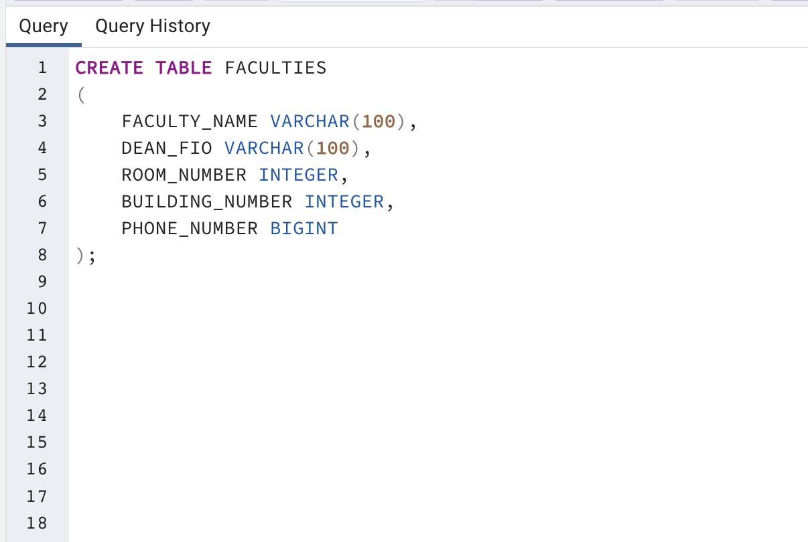
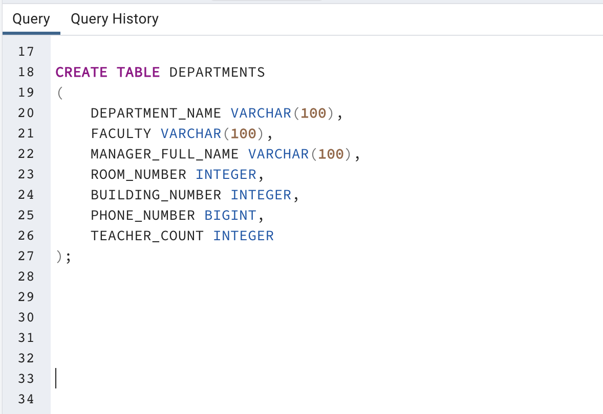
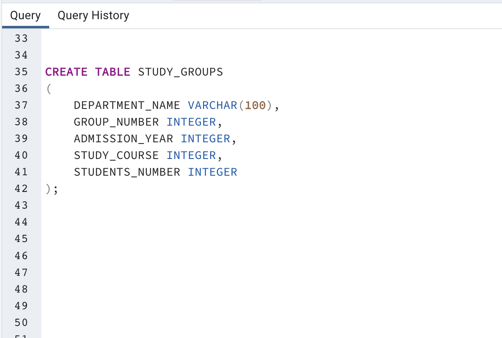
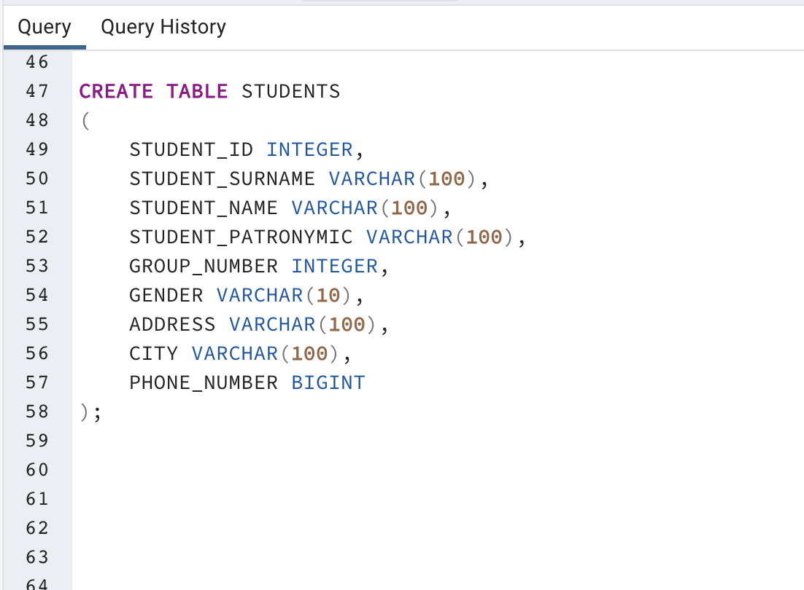
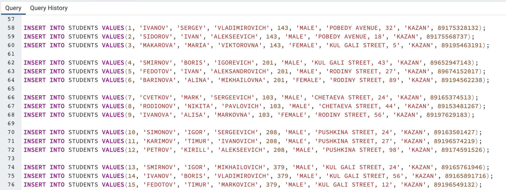
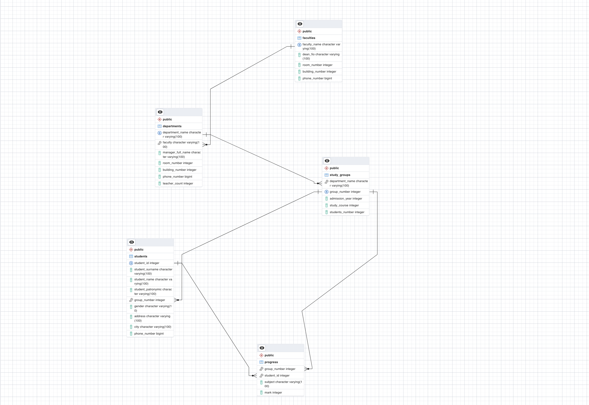

## Содержание 
- [Создание новой базы данных](#создание-новой-базы-данных)
- [Создание таблиц](#создание-таблиц)
    - [Таблица "факультеты"](#таблица-факультеты)
    - [Таблица "кафедры"](#таблица-кафедры)
    - [Таблица "группы студентов"](#таблица-группы-студентов)
    - [Таблица "студенты"](#таблица-студенты)
    - [Таблица "успеваемость"](#таблица-успеваемость)
- [Заполнение таблицы](#заполнение-таблицы)
    - [Таблица "факультеты"](#d182d0b0d0b1d0bbd0b8d186d0b0-d184d0b0d0bad183d0bbd18cd182d0b5d182d18b-1)
    - [Таблица "кафедры"](#d182d0b0d0b1d0bbd0b8d186d0b0-d0bad0b0d184d0b5d0b4d180d18b-1)
    - [Таблица "группы студентов"](#d182d0b0d0b1d0bbd0b8d186d0b0-d0b3d180d183d0bfd0bfd18b-d181d182d183d0b4d0b5d0bdd182d0bed0b2-1)
    - [Таблица "студенты"](#d182d0b0d0b1d0bbd0b8d186d0b0-d181d182d183d0b4d0b5d0bdd182d18b-1)
    - [Таблица "успеваемость"](#d182d0b0d0b1d0bbd0b8d186d0b0-d183d181d0bfd0b5d0b2d0b0d0b5d0bcd0bed181d182d18c-1)
- [Установка первичных и внешних ключей](#установка-первичных-и-внешних-ключей) 
    - [Таблицы "факультеты" и "кафедры"](#таблицы-факультеты-и-кафедры)
    - [Таблицы "кафедры" и "группы студентов"](#таблицы-кафедры-и-группы-студентов)
    - [Таблицы "группы студентов" и "студенты"](#таблицы-группы-студентов-и-студенты)
    - [Таблицы "группы студентов" и "успеваемость"](#таблицы-группы-студентов-и-успеваемость)
    - [Таблицы "студенты" и "успеваемость"](#таблицы-студенты-и-успеваемость)
- [ERD-модель](#erd-модель)

---

## Создание новой базы данных

Жмём на созданного пользователя откроется список, необходимо нажать на параметр **Databases** правой кнопкой мыши и выбираем параметр **Create** -> **Database...**


---

Далее откроется окно создания базы данных. Необходимо задать название для неё. Вводим *homework_2* и нажимаем **Save**.


## Создание таблиц

Открываем **Query Tool** в **pgAdmin** с помощью правой кнопки мыши, кликнув по названию базы данных (*homework_2*).


---

Необходимо создать 5 таблиц: **факультеты**, **кафедра**, **учебные группы**, **студенты**, **успеваемость**. 
В новом окне вводим запросы и нажимаем выполнить (*F5*): 

### Таблица "факультеты"

```
CREATE TABLE FACULTIES
(
    Id SERIAL PRIMARY KEY,
    FACULTY_NAME VARCHAR(30),
	DEAN_FIO VARCHAR(30),
	ROOM_NUMBER INTEGER,
	BUILDING_NUMBER INTEGER,
	PHONE_NUMBER INTEGER
);
```



---

### Таблица "кафедры"

```
CREATE TABLE DEPARTMENTS
(
	Id SERIAL PRIMARY KEY,
	DEPARTMENT_NAME VARCHAR(30),
	FACULTY VARCHAR(30),
	MANAGER_FULL_NAME VARCHAR(30),
	ROOM_NUMBER INTEGER,
	BUILDING_NUMBER INTEGER,
	PHONE_NUMBER INTEGER,
	TEACHER_COUNT INTEGER
);
```



---

### Таблица "группы студентов"

```
CREATE TABLE STUDY_GROUPS
(
	Id SERIAL PRIMARY KEY,
	GROUP_NUMBER INTEGER,
	ADMISSION_YEAR INTEGER,
	STUDY_COURSE INTEGER,
	STUDENTS_NUMBER INTEGER
);
```



---

### Таблица "студенты"

```
CREATE TABLE STUDENTS
(
	Id SERIAL PRIMARY KEY,
	STUDENT_ID INTEGER,
	STUDENT_SURNAME VARCHAR(30),
	STUDENT_NAME VARCHAR(30),
	STUDENT_PATRONYMIC VARCHAR(30),
	GROUP_NUMBER INTEGER,
	GENDER VARCHAR(30),
	ADDRESS VARCHAR(30),
	CITY VARCHAR(30),
	PHONE_NUMBER INTEGER
);
```



---
### Таблица "успеваемость"

```
CREATE TABLE PROGRESS
(
	GROUP_NUMBER INTEGER,
	STUDENT_ID INTEGER,
	SUBJECT VARCHAR(30),
	MARK INTEGER
);
```


---

Проверим наличие таблиц. Нажимаем **Schemas** -> **Tables** и видим, что все таблицы были действительно созданы. 


---

## Заполнение таблиц данными

Чтобы заполнить таблицу данными, необходимо снова открыть **Query Tool**  (см. [создание таблиц](#создание-таблиц)).

Заполняем все таблицы по порядку.
Вводим запросы и нажимаем выполнить (*F5*):

---

### Таблица "факультеты"

```
INSERT INTO FACULTIES VALUES(1, 'HISTORY', 'SIDOROV N.V', 209, 2, 89656242971);
INSERT INTO FACULTIES VALUES(2, 'PHYSICS', 'NOVIKOV A.T', 404, 1, 89656234955);
INSERT INTO FACULTIES VALUES(3, 'CHEMISTRY', 'SIDIKOV V.L', 212, 4, 89446421955);
INSERT INTO FACULTIES VALUES(4, 'ECONOMICS', 'BULAKOV R.K', 1502, 12, 89446421475);
INSERT INTO FACULTIES VALUES(5, 'MATHEMATICS', 'HAFIZOV E.R', 310, 9, 89439121466);
```


---

### Таблица "кафедры"

```
INSERT INTO DEPARTMENTS VALUES(1, 'HISTORY OF RUSSIA', 'HISTORY', 'IVANOV A.I', 156, 2, 89178234561, 7);
INSERT INTO DEPARTMENTS VALUES(2, 'PHYSICS OF MOLECULAR SYSTEMS', 'PHYSICS', 'SMIRNOV E.R', 16, 1, 89196351325, 5);
INSERT INTO DEPARTMENTS VALUES(3, 'ORGANIC AND MEDICINAL CHEMISTRY', 'CHEMISTRY', 'PETROVA V.I', 345, 4, 89172095417, 3);
INSERT INTO DEPARTMENTS VALUES(4, 'ECONOMICS OF PRODUCTION', 'ECONOMICS', 'BULAKOV R.K', 1502, 12, 89446421475, 6);
INSERT INTO DEPARTMENTS VALUES(5, 'GEOMETRY', 'MATHEMATICS', 'HAFIZOV E.R', 310, 9, 89439121466, 4);
```


---

### Таблица "группы студентов"

```
INSERT INTO STUDY_GROUPS VALUES(1, 143, 2020, 4, 20);
INSERT INTO STUDY_GROUPS VALUES(2, 201, 2022, 2, 23);
INSERT INTO STUDY_GROUPS VALUES(3, 103, 2021, 3, 18);
INSERT INTO STUDY_GROUPS VALUES(4, 208, 2023, 1, 28);
INSERT INTO STUDY_GROUPS VALUES(5, 379, 2023, 1, 32);
```


---

### Таблица "студенты"

```
INSERT INTO STUDENTS VALUES(1, 'IVANOV', 'SERGEY', 'VLADIMIROVICH', 143, 'MALE', 'POBEDY AVENUE, 32', 89175328132);
INSERT INTO STUDENTS VALUES(2, 'SIDOROV', 'IVAN', 'ALEKSEEVICH', 143, 'MALE', 'POBEDY AVENUE, 18', 89175568737);
INSERT INTO STUDENTS VALUES(3, 'MAKAROVA', 'MARIA', 'VIKTOROVNA', 143, 'FEMALE', 'KUL GALI STREET, 5', 89195463191);

INSERT INTO STUDENTS VALUES(4, 'SMIRNOV', 'BORIS', 'IGOREVICH', 201, 'MALE', 'KUL GALI STREET, 43', 89652947143);
INSERT INTO STUDENTS VALUES(5, 'FEDOTOV', 'IVAN', 'ALEKSANDROVICH', 201, 'MALE', 'RODINY STREET, 27', 89674152017);
INSERT INTO STUDENTS VALUES(6, 'BARINOVA', 'ALINA', 'MIKHAILOVNA', 201, 'FEMALE', 'RODINY STREET, 89', 89194562238);

INSERT INTO STUDENTS VALUES(7, 'CVETKOV', 'MARK', 'SERGEEVICH', 103, 'MALE', 'CHETAEVA STREET, 24', 89165374513);
INSERT INTO STUDENTS VALUES(8, 'RODIONOV', 'NIKITA', 'PAVLOVICH', 103, 'MALE', 'CHETAEVA STREET, 44', 89153481267);
INSERT INTO STUDENTS VALUES(9, 'IVANOVA', 'ALISA', 'MARKOVNA', 103, 'FEMALE', 'RODINY STREET, 56', 89197629183);

INSERT INTO STUDENTS VALUES(10, 'SIMONOV', 'IGOR', 'SERGEEVICH', 208, 'MALE', 'PUSHKINA STREET, 24', 89163501427);
INSERT INTO STUDENTS VALUES(11, 'KARIMOV', 'TIMUR', 'IVANOVICH', 208, 'MALE', 'PUSHKINA STREET, 27', 89196574219);
INSERT INTO STUDENTS VALUES(12, 'PETROV', 'KIRILL', 'ALEKSEEVICH', 208, 'MALE', 'PUSHKINA STREET, 98', 89174591526);

INSERT INTO STUDENTS VALUES(13, 'SMIRNOV', 'IGOR', 'MIKHAILOVICH', 379, 'MALE', 'KUL GALI STREET, 24', 89165761946);
INSERT INTO STUDENTS VALUES(14, 'IVANOV', 'BORIS', 'VLADIMIROVICH', 379, 'MALE', 'KUL GALI STREET, 56', 89165891716);
INSERT INTO STUDENTS VALUES(15, 'FEDOTOV', 'TIMUR', 'MARKOVICH', 379, 'MALE', 'KUL GALI STREET, 12', 89196549132);
```



---

### Таблица "успеваемость"

```
INSERT INTO PROGRESS VALUES(143, 1, 'HISTORY OF RUSSIA', 5);
INSERT INTO PROGRESS VALUES(143, 1, 'GEOMETRY', 4);
INSERT INTO PROGRESS VALUES(143, 1, 'CHEMISTRY', 5);

INSERT INTO PROGRESS VALUES(143, 2, 'HISTORY OF RUSSIA', 3);
INSERT INTO PROGRESS VALUES(143, 2, 'GEOMETRY', 5);
INSERT INTO PROGRESS VALUES(143, 2, 'CHEMISTRY', 4);

INSERT INTO PROGRESS VALUES(143, 3, 'HISTORY OF RUSSIA', 5);
INSERT INTO PROGRESS VALUES(143, 3, 'GEOMETRY', 5);
INSERT INTO PROGRESS VALUES(143, 3, 'CHEMISTRY', 4);


INSERT INTO PROGRESS VALUES(201, 4, 'HISTORY OF RUSSIA', 5);
INSERT INTO PROGRESS VALUES(201, 4, 'ALGEBRA', 4);
INSERT INTO PROGRESS VALUES(201, 4, 'PHYSICS', 5);

INSERT INTO PROGRESS VALUES(201, 5, 'HISTORY OF RUSSIA', 3);
INSERT INTO PROGRESS VALUES(201, 5, 'ALGEBRA', 5);
INSERT INTO PROGRESS VALUES(201, 5, 'PHYSICS', 4);

INSERT INTO PROGRESS VALUES(201, 6, 'HISTORY OF RUSSIA', 5);
INSERT INTO PROGRESS VALUES(201, 6, 'ALGEBRA', 5);
INSERT INTO PROGRESS VALUES(201, 6, 'PHYSICS', 4);


INSERT INTO PROGRESS VALUES(103, 7, 'HISTORY OF RUSSIA', 5);
INSERT INTO PROGRESS VALUES(103, 7, 'ALGEBRA', 4);
INSERT INTO PROGRESS VALUES(103, 7, 'ECONOMICS', 5);

INSERT INTO PROGRESS VALUES(103, 8, 'HISTORY OF RUSSIA', 3);
INSERT INTO PROGRESS VALUES(103, 8, 'ALGEBRA', 5);
INSERT INTO PROGRESS VALUES(103, 8, 'ECONOMICS', 4);

INSERT INTO PROGRESS VALUES(103, 9, 'HISTORY OF RUSSIA', 5);
INSERT INTO PROGRESS VALUES(103, 9, 'ALGEBRA', 5);
INSERT INTO PROGRESS VALUES(103, 9, 'ECONOMICS', 4);


INSERT INTO PROGRESS VALUES(208, 10, 'HISTORY OF RUSSIA', 5);
INSERT INTO PROGRESS VALUES(208, 10, 'ALGEBRA', 4);
INSERT INTO PROGRESS VALUES(208, 10, 'ECONOMICS', 5);

INSERT INTO PROGRESS VALUES(208, 11, 'HISTORY OF RUSSIA', 3);
INSERT INTO PROGRESS VALUES(208, 11, 'ALGEBRA', 5);
INSERT INTO PROGRESS VALUES(208, 11, 'ECONOMICS', 4);

INSERT INTO PROGRESS VALUES(208, 12, 'HISTORY OF RUSSIA', 5);
INSERT INTO PROGRESS VALUES(208, 12, 'ALGEBRA', 5);
INSERT INTO PROGRESS VALUES(208, 12, 'ECONOMICS', 4);


INSERT INTO PROGRESS VALUES(379, 13, 'HISTORY OF RUSSIA', 5);
INSERT INTO PROGRESS VALUES(379, 13, 'ALGEBRA', 4);
INSERT INTO PROGRESS VALUES(379, 13, 'PHYSICS', 5);

INSERT INTO PROGRESS VALUES(379, 14, 'HISTORY OF RUSSIA', 3);
INSERT INTO PROGRESS VALUES(379, 14, 'ALGEBRA', 5);
INSERT INTO PROGRESS VALUES(379, 14, 'PHYSICS', 4);

INSERT INTO PROGRESS VALUES(379, 15, 'HISTORY OF RUSSIA', 5);
INSERT INTO PROGRESS VALUES(379, 15, 'ALGEBRA', 5);
INSERT INTO PROGRESS VALUES(379, 15, 'PHYSICS', 4);
```


>На стадии заполнения таблиц возникла проблема с типом данных для столбцов с номером телефона, а также некоторые данные не умещались в 30 символов, чтобы это исправить, необходимо нажать правой кнопкой мыши по названию таблицы -> **Properties** -> **Column** и изменить тип данных для стобца.  
> 
> 
> 

---

## Установка первичных и внешних ключей

После заполнения таблиц значениями, необходимо расставить первичные ключи для таблиц, а затем уже и внешние. Установка первичных ключей выполняется запросом: 

### Таблицы "факультеты" и "кафедры"

```
ALTER TABLE FACULTIES
ADD CONSTRAINT unique_faculty_name UNIQUE (FACULTY_NAME);
```


Далее установим внешний ключ для этой таблицы:

```
ALTER TABLE DEPARTMENTS
ADD CONSTRAINT fk_department_faculty
FOREIGN KEY (FACULTY)
REFERENCES FACULTIES (FACULTY_NAME);
```


Проделываем то же самое для других таблиц:

---

### Таблицы "кафедры" и "группы студентов"

```
ALTER TABLE DEPARTMENTS
ADD CONSTRAINT unique_department_name UNIQUE (DEPARTMENT_NAME);
```


```
ALTER TABLE STUDY_GROUPS
ADD CONSTRAINT fk_department_id
FOREIGN KEY (DEPARTMENT_ID)
REFERENCES DEPARTMENTS (DEPARTMENT_NAME);
```


---

### Таблицы "группы студентов" и "студенты"

```
ALTER TABLE STUDY_GROUPS
ADD CONSTRAINT uk_group_number
UNIQUE (GROUP_NUMBER);
```


```
ALTER TABLE STUDENTS
ADD CONSTRAINT fk_group_number
FOREIGN KEY (GROUP_NUMBER)
REFERENCES STUDY_GROUPS (GROUP_NUMBER);
```


---

### Таблицы "группы студентов" и "успеваемость"

```
ALTER TABLE PROGRESS
ADD CONSTRAINT fk_group_number
FOREIGN KEY (GROUP_NUMBER)
REFERENCES STUDY_GROUPS (GROUP_NUMBER);
```


---

### Таблицы "студенты" и "успеваемость"

```
ALTER TABLE STUDENTS
ADD CONSTRAINT uk_srtudent_id UNIQUE (STUDENT_ID);
```


```
ALTER TABLE PROGRESS
ADD CONSTRAINT fk_student_id
FOREIGN KEY (STUDENT_ID)
REFERENCES STUDENTS (STUDENT_ID);
```


---

## ERD-модель 

Чтобы посмотреть итоговую **ERD-модель** для базы данных нажимаем правой кнопкой мыши на название базы данных (*homework_2*) и выбираем **ERD For Database**.




---
