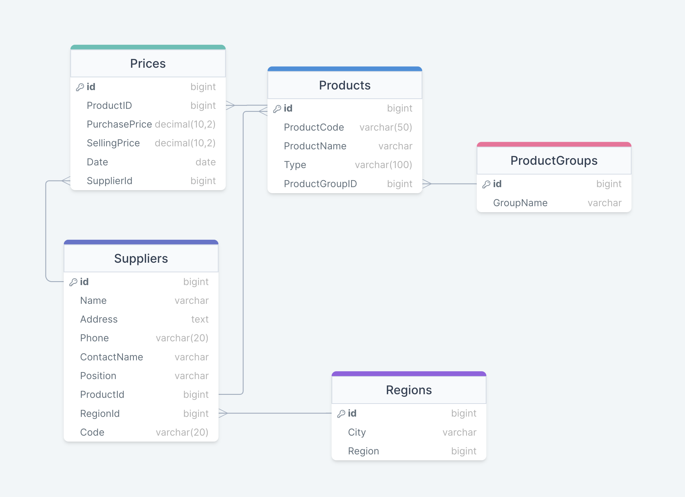

# Контрольная работа (Вариант 26)

## Проектирование базы данных 



## Написание запросов

1) Найти все молочные продукты с закупочной ценой выше средней.

<br>

```
π ProductName (σ PurchasePrice > AVG(PurchasePrice) (Products ⋈ Prices));
```

```sql
SELECT p.ProductName
FROM Products p
JOIN Prices pr ON p.ProductID = pr.ProductID
WHERE pr.PurchasePrice > (SELECT AVG(PurchasePrice) FROM Prices);
```

<br>


2) Определить поставщиков, которые предоставляют продукты в группе "Колбасные изделия".

<br>

```
π Name (σ GroupName = 'Колбасные изделия' (Suppliers ⋈ Products ⋈ ProductGroups));
```

```sql
SELECT DISTINCT s.Name
FROM Suppliers s
JOIN Products p ON s.SupplierID = p.SupplierID
JOIN ProductGroups pg ON p.ProductGroupID = pg.ProductGroupID
WHERE pg.GroupName = 'Колбасные изделия';
```

<br>

3) Найти все регионы, где присутствуют поставщики мясных продуктов, но отсутствуют поставщики молочных продуктов.

```
π RegionName (σ MeatSuppliers ∩ ¬ σ MilkSuppliers (Regions));
```

```sql
SELECT r.RegionName
FROM Regions r
WHERE EXISTS (
    SELECT 1
    FROM Suppliers s
    JOIN Products p ON s.SupplierID = p.SupplierID
    JOIN ProductGroups pg ON p.ProductGroupID = pg.ProductGroupID
    WHERE s.RegionID = r.RegionID AND pg.GroupName = 'Мясные полуфабрикаты'
) AND NOT EXISTS (
    SELECT 1
    FROM Suppliers s
    JOIN Products p ON s.SupplierID = p.SupplierID
    JOIN ProductGroups pg ON p.ProductGroupID = pg.ProductGroupID
    WHERE s.RegionID = r.RegionID AND pg.GroupName = 'Молоко'
);
```

<br>

4) Определить средний отпускной и закупочный цены для каждого продукта.

<br>

```
π ProductName,AvgPurchasePrice,AvgSellingPrice 
(γ ProductName, AVG(PurchasePrice) as AvgPurchasePrice, AVG(SellingPrice) as AvgSellingPrice (Products ⋈ ProductID Prices))
```

```sql
SELECT p.ProductName, AVG(pr.PurchasePrice) AS AvgPurchasePrice, AVG(pr.SellingPrice) AS AvgSellingPrice
FROM Products p
JOIN Prices pr ON p.ProductID = pr.ProductID
GROUP BY p.ProductName;
```

<br>

5) Найти все продукты, цена на которые изменилась в течение последних двух недель.

<br>

```
π ProductName (σ Date > start_date ∧ Date < current_date (Products ⋈ Prices))
```

```sql
SELECT p.ProductName
FROM Products p
JOIN Prices pr ON p.ProductID = pr.ProductID
WHERE pr.Date BETWEEN CURRENT_DATE - INTERVAL '14 days' AND CURRENT_DATE;
```