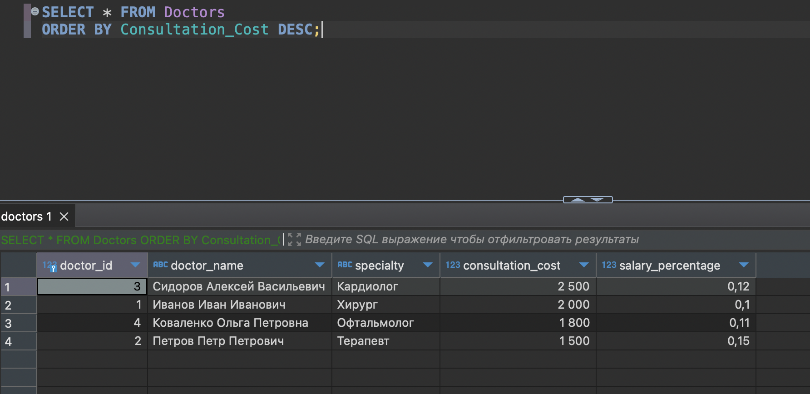
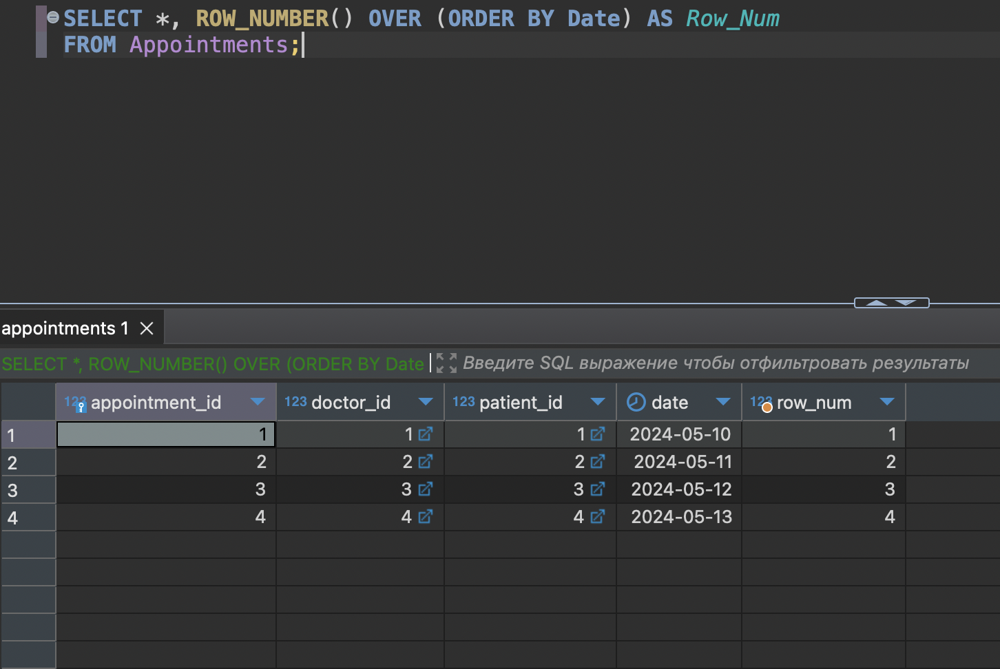

## Контрольная работа №2 (11 вариант)

## Содержимое

- [Концептуальная модель БД](#концептуальная-модель-бд)

- [Даталогическая модель](#даталогическая-модель)

- [Создание таблиц](#создание-таблиц)

- [Заполнение таблиц](#заполнение-таблиц)

- [Группировка с использованием GROUP BY](#группировка-с-использованием-group-by)

- [Группировка с условием с использованием HAVING](#группировка-с-условием-с-использованием-having)

- [Сортировка с использованием ORDER BY](#сортировка-с-использованием-order-by)

- [Использование ROLLUP](#использование-rollup)

- [Использование CUBE](#использование-cube)

- [Использование GROUPING SETS](#использование-grouping-sets)

- [Использование оконной функции OVER и ROW_NUMBER](#использование-оконной-функции-over-и-row_number)

- [Использование оконной функции OVER, PARTITION BY, LAG или LEAD](#использование-оконной-функции-over-partition-by-lag-или-lead)

- [Использование оконной функции OVER, PARTITION BY, RANK или DENSE_RANK](#использование-оконной-функции-over-partition-by-rank-или-dense_rank)

- [Использование оконной функции OVER и агрегатной функции](#использование-оконной-функции-over-и-агрегатной-функции)

## Концептуальная модель БД

### Сущности: 

1.  Врач (doctor)

    - Идентификатор врача (Doctor_ID)

    - ФИО врача (Doctor_Name)

    - Специальность врача (Specialty)

    - Стоимость приема (Consultation_Cost)

    - Процент отчисления на зарплату (Salary_Percentage)

2. Пациент (Patient)

    - Идентификатор пациента (Patient_ID)

    - Фамилия (Last_Name)

    - Имя (First_Name)

    - Отчество (Middle_Name)

    - Дата рождения (Date_of_Birth)

    - Адрес (Address)

3. Прием пациента (Appointment)

    - Идентификатор приема (Appointment_ID)

    - Идентификатор врача (Doctor_ID)

    - Идентификатор пациента (Patient_ID)

    - Дата приема (Date)


### Связи: 

- Врач может проводить много приемов, но каждый прием проводится одним врачом. (One-to-Many между Doctor и Appointment)

- Пациент может иметь много приемов, но каждый прием принадлежит одному пациенту. (One-to-Many между Patient и Appointment)

## Даталогическая модель

### Таблицы: 

1. Врачи (Doctors)

    - Doctor_ID (PK)

    - Doctor_Name (VARCHAR(100))

    - Specialty (VARCHAR(100))

    - Consultation_Cost (DECIMAL(10, 2))

    - Salary_Percentage (DECIMAL(5, 2))

2. Пациенты (Patients)

    - Patient_ID (PK)

    - Last_Name (VARCHAR(100))

    - First_Name (VARCHAR(100))

    - Middle_Name (VARCHAR(100))

    - Date_of_Birth (DATE)

    - Address (VARCHAR(255))

3. Приемы (Appointments)

    - Appointment_ID (PK)

    - Doctor_ID (FK) (INT)

    - Patient_ID (FK) (INT)

    - Date (DATE)

<br>


## Создание таблиц

### Doctors: 

```sql
CREATE TABLE Doctors (
    Doctor_ID SERIAL PRIMARY KEY,
    Doctor_Name VARCHAR(100),
    Specialty VARCHAR(100),
    Consultation_Cost DECIMAL(10, 2),
    Salary_Percentage DECIMAL(5, 2)
);
```

### Patients: 

```sql
CREATE TABLE Patients (
    Patient_ID SERIAL PRIMARY KEY,
    Last_Name VARCHAR(100),
    First_Name VARCHAR(100),
    Middle_Name VARCHAR(100),
    Date_of_Birth DATE,
    Address VARCHAR(255)
);
```

### Appointments: 

```sql
CREATE TABLE Appointments (
    Appointment_ID SERIAL PRIMARY KEY,
    Doctor_ID INT,
    Patient_ID INT,
    Date DATE,
    FOREIGN KEY (Doctor_ID) REFERENCES Doctors (Doctor_ID),
    FOREIGN KEY (Patient_ID) REFERENCES Patients (Patient_ID)
);
```

## Заполнение таблиц

### Doctors

```sql
INSERT INTO Doctors (Doctor_Name, Specialty, Consultation_Cost, Salary_Percentage)
VALUES ('Иванов Иван Иванович', 'Хирург', 2000.00, 0.10),
       ('Петров Петр Петрович', 'Терапевт', 1500.00, 0.15),
       ('Сидоров Алексей Васильевич', 'Кардиолог', 2500.00, 0.12),
       ('Коваленко Ольга Петровна', 'Офтальмолог', 1800.00, 0.11);
```

### Patients

```sql
INSERT INTO Patients (Last_Name, First_Name, Middle_Name, Date_of_Birth, Address)
VALUES ('Иванов', 'Петр', 'Иванович', '1980-05-15', 'г. Москва, ул. Ленина, д. 10, кв. 5'),
       ('Петров', 'Иван', 'Петрович', '1975-10-20', 'г. Санкт-Петербург, ул. Пушкина, д. 20, кв. 10'),
       ('Сидорова', 'Анна', 'Алексеевна', '1990-03-08', 'г. Екатеринбург, ул. Советская, д. 5, кв. 15'),
       ('Коваленко', 'Ольга', 'Петровна', '1985-12-12', 'г. Новосибирск, ул. Кирова, д. 30, кв. 3');
```

### Appointments

```sql
INSERT INTO Appointments (Doctor_ID, Patient_ID, Date)
VALUES (1, 1, '2024-05-10'),
       (2, 2, '2024-05-11'),
       (3, 3, '2024-05-12'),
       (4, 4, '2024-05-13');
```

## Группировка с использованием GROUP BY

*Запрос группирует записи из таблицы `Doctors` по специальности (`Specialty`). Затем для каждой уникальной специальности подсчитывается количество записей. Таким образом, выводится количество врачей каждой специальности.*

```sql
SELECT Specialty, COUNT(*) AS Num_Appointments
FROM Doctors
JOIN Appointments ON Doctors.Doctor_ID = Appointments.Doctor_ID
GROUP BY Specialty;
```

**Результат:**


## Группировка с условием с использованием HAVING

*Запрос аналогичен предыдущему запросу, но добавляет условие `HAVING`, которое фильтрует результаты группировки. В данном случае выводятся только те специальности врачей, у которых количество записей (количество приемов) больше 1.*

```sql
SELECT Specialty, COUNT(*) AS Num_Appointments
FROM Doctors
JOIN Appointments ON Doctors.Doctor_ID = Appointments.Doctor_ID
GROUP BY Specialty
HAVING COUNT(*) > 1;
```

**Результат:**


## Сортировка с использованием ORDER BY

*Запрос выбирает все записи из таблицы Doctors и сортирует их по стоимости приема (`Consultation_Cost`) в порядке убывания. Таким образом, выводятся все данные о врачах, отсортированные по убыванию стоимости приема.*

```sql
SELECT * FROM Doctors
ORDER BY Consultation_Cost DESC;
```

**Результат:**



## Использование ROLLUP

*Создаем итогововую строку, отображающую суммарное количество приемов для каждого врача по специальностям и общее количество приемов с помощью `ROLLUP`. Таким образом, выводятся данные о количестве приемов для каждого врача по специальностям, а также общее количество приемов.*

```sql
SELECT Doctors.Doctor_ID, Doctors.Specialty, COUNT(*) AS Num_Appointments
FROM Doctors
JOIN Appointments ON Doctors.Doctor_ID = Appointments.Doctor_ID
GROUP BY ROLLUP (Doctors.Doctor_ID, Doctors.Specialty);
```

**Результат:**


## Использование CUBE

*Создаем все возможные комбинации группировки данных по врачам и специальностям с помощью `CUBE`. Таким образом, выводятся данные о количестве приемов для каждого врача по специальностям, а также общее количество приемов, не учитывая специальности.*

```sql
SELECT Doctors.Doctor_ID, Doctors.Specialty, COUNT(*) AS Num_Appointments
FROM Doctors
JOIN Appointments ON Doctors.Doctor_ID = Appointments.Doctor_ID
GROUP BY CUBE (Doctors.Doctor_ID, Doctors.Specialty);
```

**Результат:**


## Использование GROUPING SETS

*Создаем различные уровни группировки данных по врачам и специальностям с помощью `GROUPING SETS`. Таким образом, выводятся данные о количестве приемов для каждого врача по специальностям, а также общее количество приемов.*

**Результат:**


## Использование оконной функции OVER и ROW_NUMBER

*Присваиваем каждой записи в наборе уникальный номер, который соответствует порядку сортировки по полю `Date`. Таким образом, можно легко определить порядок или позицию каждой записи относительно других записей в таблице `Appointments`.*

```sql
SELECT *, ROW_NUMBER() OVER (ORDER BY Date) AS Row_Num
FROM Appointments;
```

**Результат:**



## Использование оконной функции OVER, PARTITION BY, LAG или LEAD

*Получаем значения предыдущего и следующего приемов для каждого врача с помощью `LAG` и `LEAD`. При использовании `PARTITION BY Doctor_ID` функции `LAG` и `LEAD` работают только внутри каждой группы записей, относящихся к конкретному врачу.*

```sql
SELECT Doctor_ID, Date,
       LAG(Date) OVER (PARTITION BY Doctor_ID ORDER BY Date) AS Previous_Appointment,
       LEAD(Date) OVER (PARTITION BY Doctor_ID ORDER BY Date) AS Next_Appointment
FROM Appointments;
```

**Результат:**


## Использование оконной функции OVER, PARTITION BY, RANK или DENSE_RANK

*Вычисляем ранг каждого приема для каждого врача на основе даты приема.*

```sql
SELECT Doctor_ID, Date,
       RANK() OVER (PARTITION BY Doctor_ID ORDER BY Date) AS Appointment_Rank
FROM Appointments;
```

**Результат:**


## Использование оконной функции OVER и агрегатной функции

*Вычисляем среднюю стоимость приема для каждого врача с помощью `AVG` в сочетании с `OVER` и `PARTITION BY`.*

```sql
SELECT Doctor_ID, AVG(Consultation_Cost) OVER (PARTITION BY Doctor_ID) AS Avg_Consultation_Cost
FROM Doctors;
```

**Результат:**

